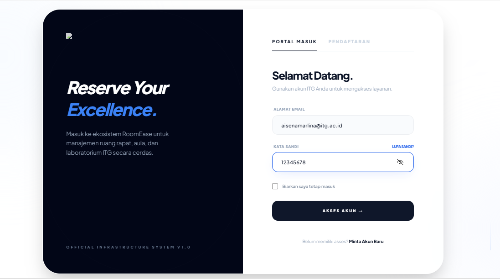

# 🏫 RoomEase  
**Smart & Fast Campus Facility Booking**

RoomEase adalah aplikasi berbasis web yang dikembangkan untuk mempermudah proses peminjaman ruangan dan fasilitas kampus secara digital, terpusat, dan transparan di lingkungan **Institut Teknologi Garut (ITG)**.

---

## 📌 Deskripsi Proyek

RoomEase dirancang sebagai solusi atas permasalahan peminjaman fasilitas kampus yang masih dilakukan secara manual. Sistem ini menyediakan alur peminjaman terintegrasi, mulai dari pengajuan oleh mahasiswa hingga proses persetujuan oleh admin sarana dan prasarana.

Dengan RoomEase, seluruh data peminjaman tersimpan secara terpusat dan dapat dipantau melalui dashboard admin, sehingga mengurangi risiko bentrok jadwal dan kesalahan pencatatan.

---

## 🎯 Tujuan Pengembangan

1. **Efisiensi Birokrasi**  
   Mengurangi proses peminjaman manual berbasis kertas yang memakan waktu.

2. **Transparansi & Validasi Jadwal**  
   Mencegah bentrok penggunaan ruangan melalui validasi waktu peminjaman otomatis.

3. **Sentralisasi Data**  
   Menyediakan dashboard terpadu bagi admin untuk memantau seluruh aktivitas peminjaman fasilitas kampus.

---

## 🧩 Fitur Utama

- Registrasi dan Login Pengguna  
- Pengajuan peminjaman ruangan/fasilitas  
- Validasi jadwal peminjaman otomatis  
- Manajemen status peminjaman (Menunggu, Disetujui, Ditolak)  
- Dashboard admin sarana prasarana  
- Riwayat peminjaman pengguna  

---

## 🛠️ Teknologi yang Digunakan

- **Framework Backend:** Laravel 10  
- **Bahasa Pemrograman:** PHP 8.1  
- **Database:** MySQL / MariaDB  
- **Frontend UI:** Tailwind CSS  
- **Interaktivitas:** Alpine.js  
- **Package Manager:** Composer & NPM  
- **Development Tools:**  
  - Visual Studio Code  
  - XAMPP / Laragon  
  - Git & GitHub  

---

## 👥 Tim Pengembang

### Nama Kelompok  
**RoomEase Team**

### Anggota Kelompok

| No | Nama Lengkap              | NIM       |
|----|---------------------------|-----------|
| 1  | Meitha Amanda             | 2307005   |
| 2  | Ai Sena Marlina            | 2307017   |
| 3  | Ai Hilma Khoiriyah         | 2307022   |

---

## 🚀 Cara Menjalankan Project

1. Clone repository:
   ```bash
   git clone https://github.com/MeithaAmanda/peminjamna-ruangan.git
````

2. Masuk ke direktori project:

   ```bash
   cd roomease
   ```

3. Install dependency:

   ```bash
   composer install
   npm install
   ```

4. Copy file environment:

   ```bash
   cp .env.example .env
   ```

5. Generate application key:

   ```bash
   php artisan key:generate
   ```

6. Konfigurasi database di file `.env`

7. Jalankan migrasi:

   ```bash
   php artisan migrate
   ```

8. Jalankan server:

   ```bash
   php artisan serve
   ```

---
## 📸 Screenshot Aplikasi

### Landing Page


---

### Login & Register



---

### Tampilan User

#### Dashboard User


#### Daftar Ruangan


#### Booking Ruangan


---

### Tampilan Admin

#### Dashboard Admin


#### Konfirmasi Peminjaman Ruangan


